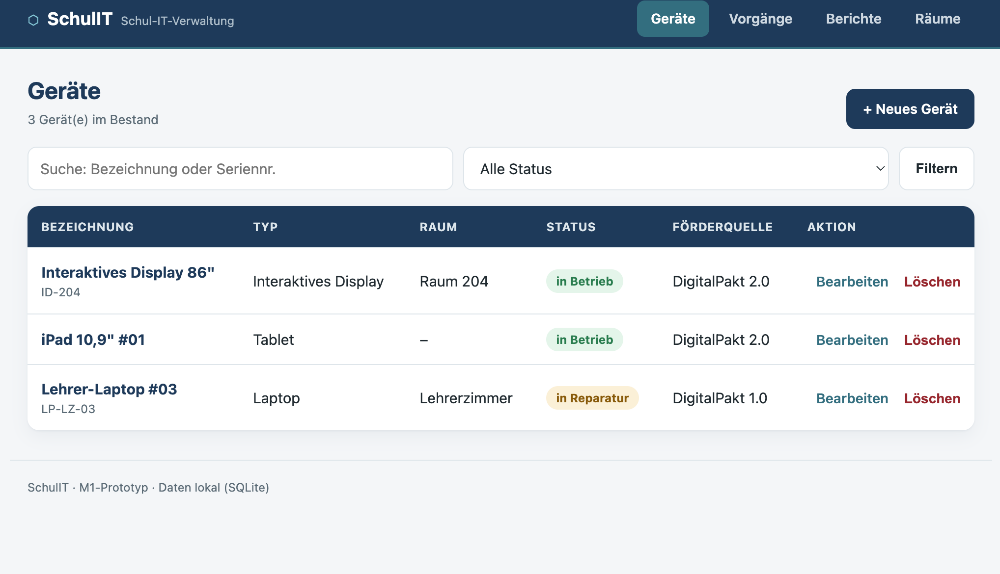
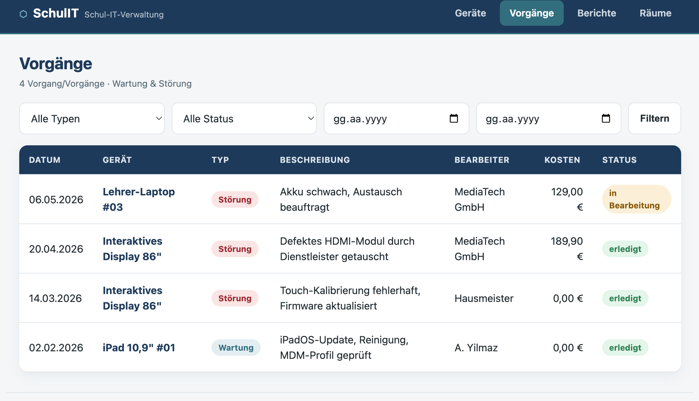
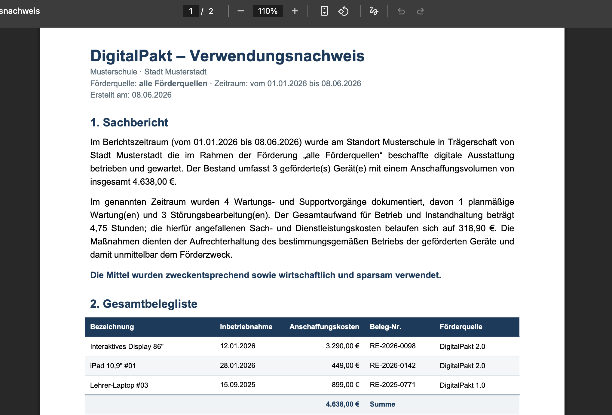

# SchulIT — Schul-IT-Verwaltung

Ein schlankes, server-gerendertes Verwaltungswerkzeug für die IT-Ausstattung
kleiner Schulen. SchulIT bündelt Geräte- und Raumverwaltung, Wartungs- und
Störungsvorgänge sowie die Erstellung von DigitalPakt-Nachweisen an einem Ort —
ohne Cloud-Zwang, mit lokaler SQLite-Datenbank und mobil-tauglicher Oberfläche.

> Status: funktionsfähiger Prototyp (M1 + M2 + M5).

## Screenshots

### Geräteverwaltung


### Wartung & Störungen


### DigitalPakt-Nachweisbericht


## Funktionen

- **Geräte (Geräteverwaltung)** — Anlegen, Bearbeiten, Löschen; Suche nach
  Bezeichnung/Seriennummer und Statusfilter; mobile Kartenansicht.
- **Räume** — einfache Raumverwaltung, Zuordnung von Geräten.
- **Förderfelder** — optionale Angaben je Gerät (Förderquelle,
  Anschaffungskosten, Inbetriebnahme, Beleg-Nr.) inkl. automatischer
  **Zweckbindung** (5 Jahre).
- **Vorgänge (M2)** — Wartungs- und Störungseinträge je Gerät mit Aufwand,
  Bearbeiter, Kostenart und Kosten; gefilterte Gesamtliste und chronologische
  Geräte-Zeitleiste.
- **Berichte / DigitalPakt (M5)** — PDF-Verwendungsnachweis mit vier
  Abschnitten: Sachbericht, Gesamtbelegliste, Wartungs- und Support-Nachweis
  sowie Zweckbindungs-Übersicht. Deutsche Zahlenformatierung (`1.234,56 €`).

## Technik

- **FastAPI** + **SQLModel** (SQLite), serverseitiges Rendering mit **Jinja2**.
- **reportlab** für die PDF-Berichte.
- Keine clientseitige Datenhaltung — robust im Schulnetz.
- SQLite → PostgreSQL: nur `DATABASE_URL` in `database.py` (bzw. als
  Umgebungsvariable) ändern.

## Schnellstart

```bash
cd schulit
python3 -m venv .venv && source .venv/bin/activate   # Windows: .venv\Scripts\activate
pip install -r requirements.txt
uvicorn main:app --reload
```

Im Browser öffnen: <http://127.0.0.1:8000>

Beim ersten Start wird `schulit.db` (SQLite) automatisch mit Beispieldaten
(Räume, Geräte, Vorgänge) angelegt. Zum Zurücksetzen einfach `schulit.db`
löschen und den Server neu starten.

## Projektstruktur

| Datei            | Zweck                                                        |
|------------------|-------------------------------------------------------------|
| `main.py`        | FastAPI-App, Routen für Geräte, Vorgänge, Berichte, Räume    |
| `models.py`      | SQLModel-Datenmodell + Auswahlwerte                          |
| `database.py`    | DB-Setup und Beispieldaten                                   |
| `bericht.py`     | PDF-Erzeugung (DigitalPakt-Verwendungsnachweis)             |
| `formatting.py`  | Deutsche Zahlen-/Datumsformatierung (Web + PDF)             |
| `templates/`     | Jinja2-Templates                                            |
| `static/`        | CSS (Design-System)                                         |

## Roadmap

- **M3** — QR-Etiketten + „Problem melden“ (Störungsmeldung ohne Login)
- **M4** — Übersicht (Dashboard)
- **M6** — DSGVO-Werkzeuge, CSV-Import

## Lizenz

[MIT](LICENSE) © 2026 Haydar Kozat
